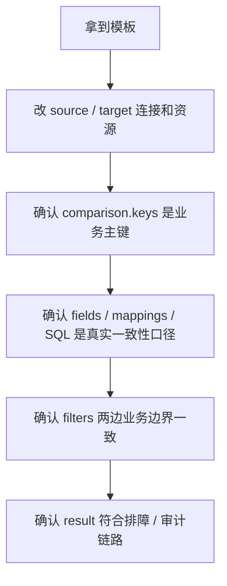

# 05｜七个常见场景，直接拿去改

> 导读：
> 这一篇不再写脱离实际项目的抽象模板，而是直接给你 7 个更贴近真实落地场景的配置起点。你可以先拿最接近自己业务的那一份，再改连接、主键、字段口径和结果输出。
>
> Github:
> https://github.com/datavane/consilens
> 欢迎关注、Star、Fork，参与贡献

前面几篇讲的是原理。这一篇只做一件事：给你一组更接近真实项目的模板。

这些模板都不是“直接上线版”，而是“直接改造版”。拿走之前，至少先确认四件事：连接信息、业务主键、字段口径、结果去向。

## 场景一：先跑通一个最小可用的跨库核对

适合第一次接入、先验证链路能不能跑通，也适合给团队做最小 PoC。

```yaml
source:
  type: mysql
  name: source-mysql
  connection:
    url: jdbc:mysql://localhost:3306/mydb
    username: ${env.MYSQL_USER}
    password: ${env.MYSQL_PASSWORD}
  resource:
    type: table
    name: users

target:
  type: postgresql
  name: target-postgresql
  connection:
    url: jdbc:postgresql://localhost:5432/postgres?currentSchema=public
    username: ${env.PG_USER}
    password: ${env.PG_PASSWORD}
  resource:
    type: table
    name: users

comparison:
  keys:
    source:
      - id
    target:
      - id
  fields:
    source:
      - name
      - email
      - status
    target:
      - name
      - email
      - status

strategy:
  mode: checksum
  algorithm: xor

result:
  sinks:
    - format: console
      type: result
```

这是最适合起步的模板：字段明确、主键简单、只输出汇总结果，出了问题也容易定位。

## 场景二：同库迁移验收，直接做表对表比对

适合老表迁到新表、备份表回灌验证、同库内数据改造后的验收。

```yaml
source:
  type: mysql
  connection:
    url: jdbc:mysql://localhost:3306/mydb
    username: ${env.MYSQL_USER}
    password: ${env.MYSQL_PASSWORD}
  resource:
    type: table
    name: orders
  readOptions:
    consistency: snapshot
    fetchSize: 1000
    useCursorFetch: true

target:
  type: mysql
  connection:
    url: jdbc:mysql://localhost:3306/mydb
    username: ${env.MYSQL_USER}
    password: ${env.MYSQL_PASSWORD}
  resource:
    type: table
    name: orders_backup
  readOptions:
    consistency: snapshot
    fetchSize: 1000
    useCursorFetch: true

comparison:
  keys:
    source:
      - order_id
    target:
      - order_id
  fields:
    source:
      - customer_id
      - amount
      - status
    target:
      - customer_id
      - amount
      - status
  filters:
    source: "created_at >= '2025-01-01'"
    target: "created_at >= '2025-01-01'"

strategy:
  mode: join
  algorithm: concat
  batchSize: 500
```

这个场景的重点不是跨库，而是**同一个 JDBC URL** 下直接做 join，比对迁移前后是否一致。

## 场景三：两边字段名不同，或者还要顺手做表达式清洗

适合 ODS 到 DWD、旧字段到新字段、手机号和姓名需要先做标准化的场景。

```yaml
comparison:
  keys:
    source:
      - id
    target:
      - id

  mappings:
    - name: user_id
      source:
        column: id
      target:
        column: id
      key: true

    - name: normalized_name
      source:
        expression: "UPPER(name)"
      target:
        expression: "UPPER(name)"

    - name: email
      source:
        column: email
      target:
        column: email

    - name: normalized_phone
      source:
        expression: "REPLACE(phone, '+86', '')"
      target:
        expression: "REPLACE(phone, '+86', '')"

    - name: source_system
      source:
        literal: "seed-users"
      target:
        literal: "seed-users"
```

`mappings` 的价值不只是“字段改名”，更重要的是把两边先投影成同一套业务语义，再进入比对。

## 场景四：只比较关键字段，排除噪音列

适合链路里存在精度不稳定字段、无业务意义字段，或者你只想先盯住核心口径的时候。

```yaml
comparison:
  keys:
    source:
      - record_id
    target:
      - record_id
  exclude:
    source:
      - col_float
    target:
      - col_float

strategy:
  mode: checksum
  algorithm: xor
  bisectionFactor: 8
  bisectionThreshold: 8000
```

这个例子里排除了 `col_float`，本质上是在告诉你：**不要为了“全字段覆盖”强行把噪音列算进一致性口径。**

## 场景五：先用 SQL 把两边塑形成同一组逻辑列，再比较

适合下游表结构不完全一致、需要先筛字段或做投影，但又不想把复杂逻辑塞进 `mappings` 的场景。

```yaml
source:
  type: mysql
  resource:
    type: sql
    path: |
      SELECT record_id,
        col_tinyint,
        col_int,
        col_decimal,
        amount,
        status,
        updated_at
      FROM consilens_performance_demo_table

target:
  type: postgresql
  resource:
    type: sql
    path: |
      SELECT record_id,
        col_tinyint,
        col_int,
        col_decimal,
        amount,
        status,
        updated_at
      FROM consilens_performance_demo_table

comparison:
  keys:
    source:
      - record_id
    target:
      - record_id
```

如果你的业务已经天然依赖 SQL 口径，这种写法通常比在配置层东拼西凑更稳，也更方便排查。

## 场景六：明细表对汇总表，做日级或状态级对账

适合订单明细对账单、交易流水对日报、事实表对汇总宽表。

```yaml
source:
  type: mysql
  resource:
    type: sql
    path: |
      SELECT DATE(created_at) AS biz_date,
        status,
        COUNT(*) AS order_count,
        SUM(amount) AS total_amount,
        MAX(updated_at) AS updated_at
      FROM consilens_performance_demo_table
      WHERE deleted = 0
      GROUP BY DATE(created_at), status

target:
  type: postgresql
  resource:
    type: table
    name: daily_order_summary

comparison:
  keys:
    source:
      - biz_date
      - status
    target:
      - biz_date
      - status
  fields:
    source:
      - order_count
      - total_amount
      - updated_at
    target:
      - order_count
      - total_amount
      - updated_at
  filters:
    source: "biz_date >= '2026-05-01' AND biz_date < '2026-05-02'"
    target: "biz_date >= '2026-05-01' AND biz_date < '2026-05-02'"
```

这类场景的关键是先把明细侧聚成和目标表同一层级，再比较；不要直接拿明细表去撞聚合表。

## 场景七：把结果直接写回数据库，接入审计和治理链路

适合生产环境接告警、审计留痕、治理平台消费结果。

```yaml
result:
  sinks:
    - format: table
      type: result
      properties:
        type: postgresql
        url: jdbc:postgresql://localhost:5432/postgres?currentSchema=public
        username: ${env.PG_USER}
        password: ${env.PG_PASSWORD}
        tableName: dv_actual_values
        createTable: true
        batchSize: 1000
        columns:
          - name: actual_value
            value: ${totalDifferences}
            columnType: decimal(20,4)

    - format: table
      type: diff-record
      properties:
        type: postgresql
        url: jdbc:postgresql://localhost:5432/postgres?currentSchema=public
        username: ${env.PG_USER}
        password: ${env.PG_PASSWORD}
        prefix: diff_results_
        createTable: true
        batchSize: 1000
```

如果你只在控制台看结果，这个工具更像一次性排障脚本；把结果落库之后，它才真正进入工程化闭环。

## 这 7 个模板怎么选

如果你是第一次接入，从场景一开始。

如果你是同库迁移验收，用场景二。

如果字段名、表达式或口径不一致，从场景三和场景五里选。

如果你是在做对账，而不是逐行字段核对，看场景六。

如果你已经进入生产链路，至少把场景七补上。

如果你的场景已经进入分区表按天切片校验，或者是百万级、千万级大表高并发巡检，可以在这 7 个模板的基础上继续补 `filters`、`concurrency` 和更激进的 `strategy` 参数。

## 使用模板前，先改这五处

拿到任何模板，都先检查：



1. `source` / `target` 的连接、库名、表名是不是你自己的；
2. `comparison.keys` 是不是真正的业务主键；
3. `fields`、`mappings` 或 SQL 里表达的是不是你认可的一致性口径；
4. `filters` 两边是不是同一批数据、同一业务边界；
5. `result` 是不是已经接上你的排障、审计或治理链路。

模板真正的价值，不是帮你省掉思考，而是让你从一个靠谱起点出发。
